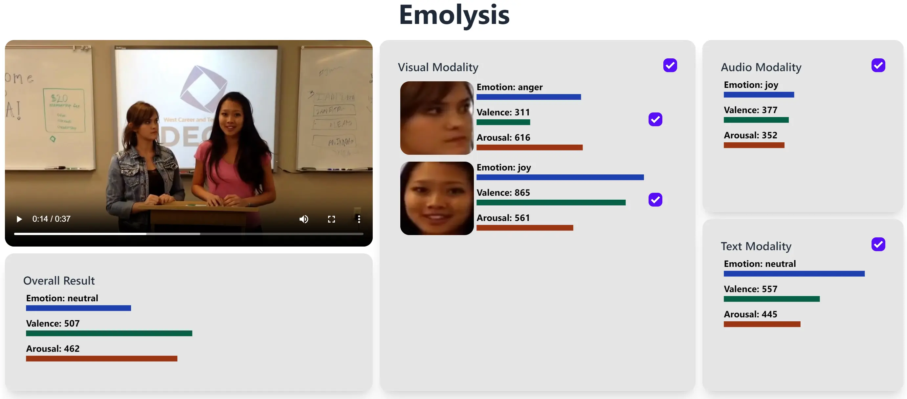

# Emolysis: A Multimodal Open-Source Group Emotion Analysis and Visualization Toolkit

<div align="center">
    
    <p></p>
</div>

<div align="center">
    <a href="https://github.com/ControlNet/emolysis/issues">
        
    </a>
    <a href="https://github.com/ControlNet/emolysis/network/members">
        
    </a>
    <a href="https://github.com/ControlNet/emolysis/stargazers">
        
    </a>
    <a href="https://github.com/ControlNet/emolysis/blob/master/LICENSE">
        
    </a>
    <a href="https://arxiv.org/abs/2305.05255">
        
    </a>
    <a href="https://huggingface.co/ControlNet/emolysis">
        
    </a>
</div>

<div align="center">
    <a href="https://github.com/ControlNet/emolysis/actions"></a>
    <a href="https://github.com/ControlNet/emolysis/actions"></a>
</div>

This repo is official repository for the paper [Emolysis: A Multimodal Open-Source Group Emotion Analysis and Visualization Toolkit](https://arxiv.org/abs/2305.05255).

## Get Started

We provided a static demo review for you to try. Please visit [https://emolysis.controlnet.space/local/1](https://emolysis.controlnet.space/local/1).

If you want to analyze your own video, please follow the instructions below to deploy the server.

## Deploy the Server

### From Docker (x86 with CUDA)

Requires:
- Docker
- nvidia-docker

Run the server.
```bash
docker run --runtime nvidia -p <PORT>:8000 [-v <CACHE_DIR_FOR_MODELS>:/app/checkpoints] --name emolysis controlnet/emolysis
```

Then, you can access the app at `http://127.0.0.1:<PORT>`.

### From Source

Requires:
- Conda
- Node.js

Install dependencies.
```bash
npm install
npm run build
cd service
bash -i build_env.sh  # use `build_env.mac.sh` for arm-based mac
conda activate emolysis
cd ..
```

Run the server.
```bash
python service/main.py --port <PORT>
```

Then, you can access the app at `http://127.0.0.1:<PORT>`.

## References

If you find this work useful for your research, please consider citing it.
```bibtex
@article{ghosh2023emolysis,
  title = {Emolysis: A Multimodal Open-Source Group Emotion Analysis and Visualization Toolkit},
  action = {Ghosh, Shreya and Cai, Zhixi and Gupta, Parul and Sharma, Garima and Dhall, Abhinav and Hayat, Munawar and Gedeon, Tom},
  journal = {arXiv preprint arXiv:2305.05255},
  year = {2023},
}
```
